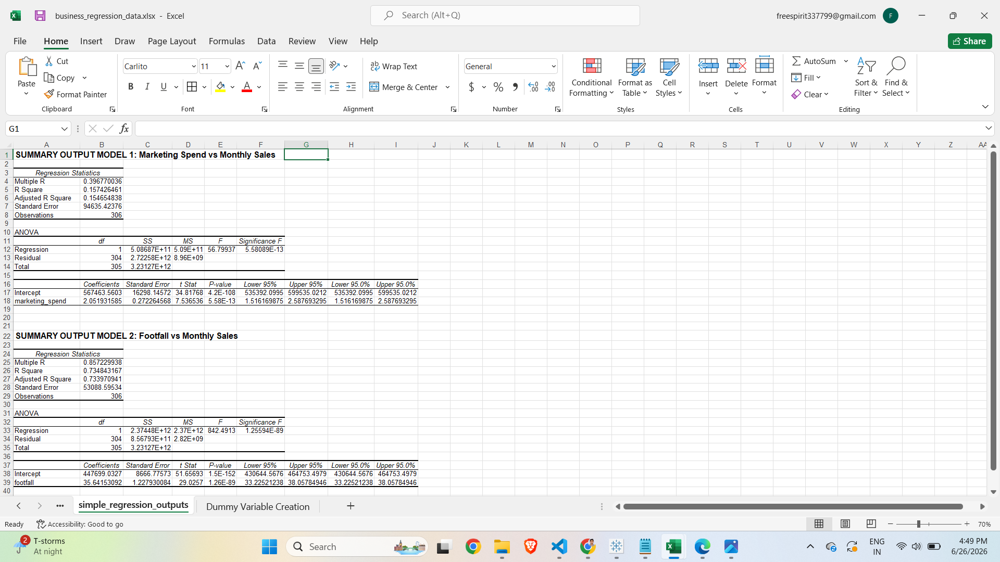
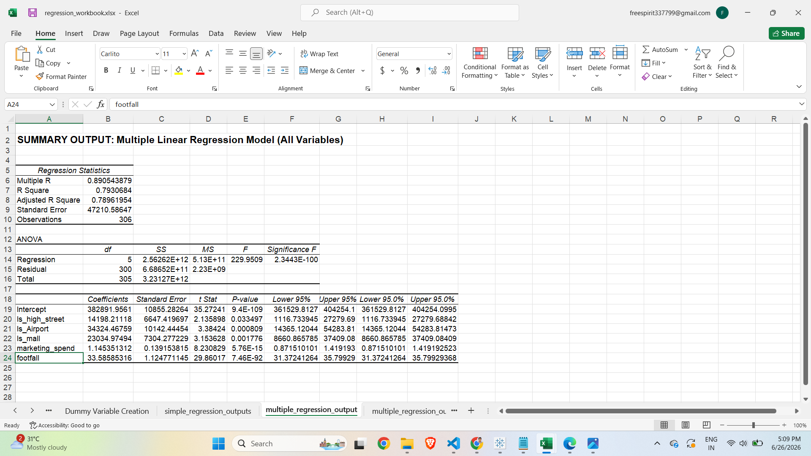
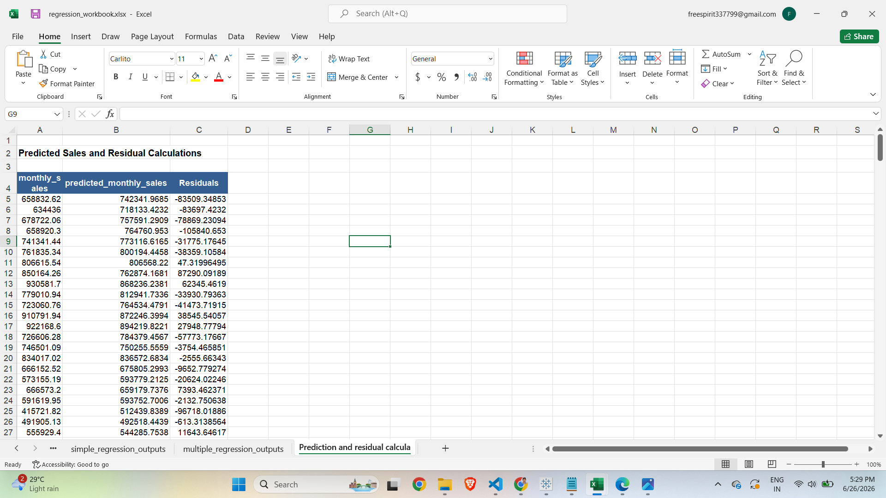
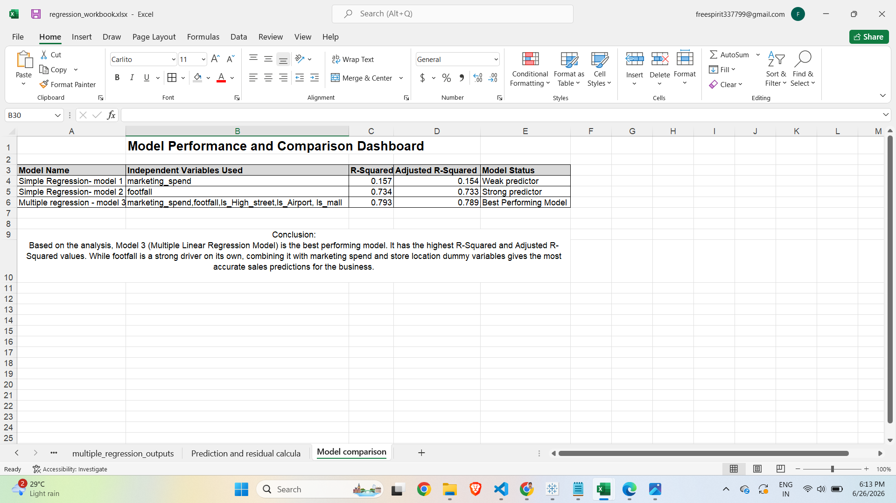

# Sales Optimization & Linear Regression Analysis Dashboard

This repository contains a full end-to-end data analytics project designed to evaluate, predict, and optimize monthly store sales using Linear Regression techniques in Excel.

---

## 🏢 Business Problem Summary
The objective of this project is to identify the core drivers behind store performance and provide executive leadership with a data-backed tool to forecast sales, allocate marketing budgets effectively, and choose high-yielding future store locations.

---

## 📊 Dataset & Variable Description
The study analyzes an operational dataset containing **306 unique store observations**.
* **Dependent Variable (Y):** `monthly_sales` (Total revenue generated by a store in a month)
* **Independent Variables (X):**
  * `marketing_spend` (Numerical - Budget spent on local advertisements)
  * `footfall` (Numerical - Number of unique customers entering the store)
  * `store_type` (Categorical - Location classification: Residential, High Street, Airport, Mall)

---

## 🛠️ Analytics & Dummy Variable Approach
To incorporate store locations into a predictive model without causing multicollinearity (the Dummy Variable Trap), the categorical variable `store_type` was encoded into binary dummy variables. 
* **Reference Category:** `Residential`
* **Active Model Predictors:** `Is_High_Street`, `Is_Airport`, and `Is_Mall`.

---

## 📈 Model Comparison Summary

| Model Name | Independent Variables Used | R-Squared | Adjusted R-Squared | Model Status |
| :--- | :--- | :---: | :---: | :--- |
| Simple Regression - Model 1 | marketing_spend | 0.157 | 0.154 | Weak Predictor |
| Simple Regression - Model 2 | footfall | 0.734 | 0.733 | Strong Predictor |
| Multiple Regression - Model 3 | marketing_spend, footfall, Is_High_Street, Is_Airport, Is_Mall | **0.793** | **0.789** | **Best Performing Model** |

**Final Model Selected:** Model 3 (Multiple Regression) is selected because it captures maximum business variance (79.3%) and provides a highly precise forecasting formula for expansion planning.

---

## 🚀 Key Business Recommendation
Executive focus must pivot towards secure commercial real estate in **Airports (+$34,324.46 baseline premium)** and **Malls (+$23,034.97 premium)**. Footfall remains our primary revenue driver, whereas marketing spend should be tightly budgeted as it yields a lower standalone return ($1.15 return per $1 spent).

---

## ⚠️ Key Limitations
* **Causation vs Association:** The model outlines strong correlations but cannot mathematically prove absolute operational causation.
* **Exclusions:** The analysis lacks external factors such as competitor density, market seasonality, and real-time inventory stockout metrics.

---

## 📸 Project Screenshots

Here are the verified visual outputs from the regression workbook saved in the repository:

### 1. Simple Regression Output

### 2. Multiple Regression Output

### 3. Predicted Values and Residuals

### 4. Model Comparison Dashboard Preview

